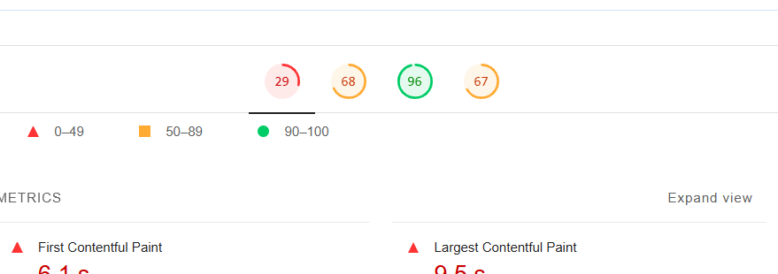
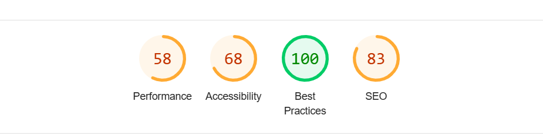
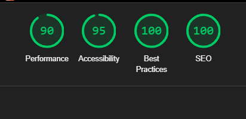

# CineScope

Başlangıçta Lighthouse performans skorlarımız oldukça düşüktü (29 puan). Ancak, aşağıdaki optimizasyonları uygulayarak skorlarımızı yükselttik.

* Meta Etiketleri Ekledik
* Resimlere alt Etiketi Ekledik
* Resimlerde lazy loading kullandık.

Daha sonra puanımız bu şekilde yükseldi. Ardından şunları yaptık.

* Kullanılmayan CSS kodlarını sildik.
* Yorum satırlarını kaldırdık.
* Styled component'ları ayrı bir dosyaya taşıdık.
* Favicon ekledik

