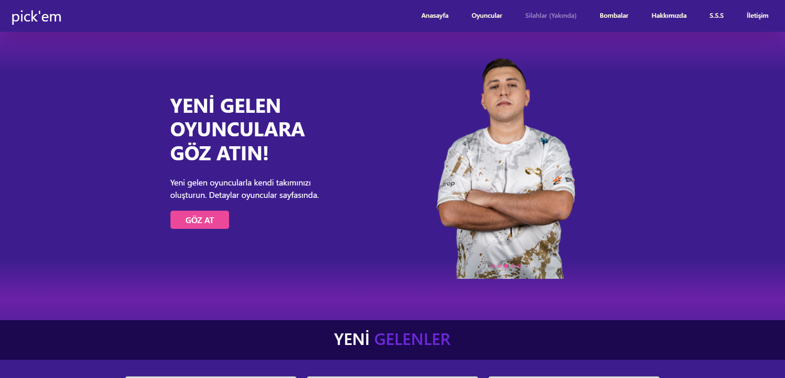
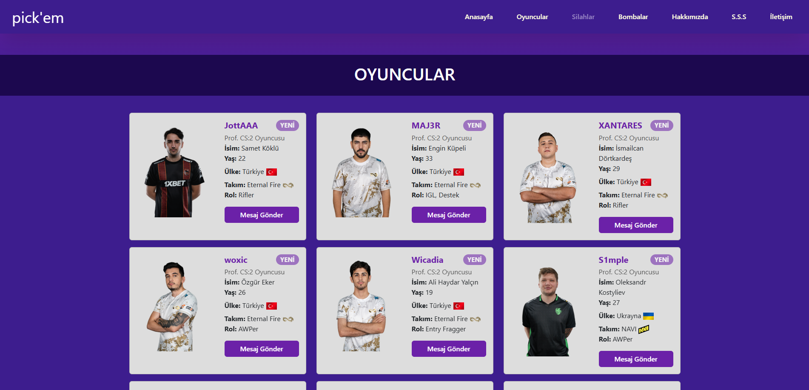

# Pickem Store

Pickem Store, e-spor tutkunlarına özel olarak tasarlanmış bir platformdur. Takımınızda oyuncu eksikliği yaşıyorsanız, buradan ihtiyaçlarınıza uygun oyuncular bulabilirsiniz.

---

## Özellikler

- **Profesyonel E-spor Oyuncuları:** En sevdiğiniz takımların oyuncuları ile anlaşarak takımınıza alabilirsiniz.
- **Kişiselleştirilmiş Deneyim:** Pick'em Store'a abone olun ve yeni gelen oyunculardan anına haberdar olun.

---

## Kurulum

1. Bu projeyi klonlayın:
   ```bash
   git clone https://github.com/waroi/TurkcellFrontend2025.git
   ```
2. Proje dizinine gidin:
   ```bash
   cd TurkcellFrontend2025/Ogrenciler/FurkanFirat/Odevler/Odev1
   ```
3. Gerekli bağımlılıkları yükleyin:
   ```bash
   npm install
   ```
4. Projeyi çalıştırın:
   ```bash
   index.html dosyasını doğrudan bir tarayıcıda açabilirsiniz.
   ```

---

## Kullanım

1. Siteye giriş yapın
2. E-spor oyuncularına mesaj göndererek anlaşmalar yapın.
3. Size uygun olan e-spor oyuncusunu takımınıza alın.

---

## Ekran Görüntüleri

- Ana Sayfa:
  
- Ürün Detayları:
  

---

## Desteklenen Teknolojiler

- HTML
- CSS
- SCSS
- Bootstrap

---

## Katkıda Bulunma

Katkıda bulunmak için:

1. Bu projeyi fork edin.
2. Yeni bir dal oluşturun:
   ```bash
   git checkout -b yeni-ozellik
   ```
3. Değişikliklerinizi yapın ve commit edin:
   ```bash
   git commit -m "Yeni özellik eklendi."
   ```
4. Dalınızı ana depoya push edin:
   ```bash
   git push origin yeni-ozellik
   ```
5. Bir pull request oluşturun.

---

## İletişim

- **E-posta:** info@pickemstore.com
- **LinkedIn:** [Pickem Store](https://www.linkedin.com/in/firatfurkan/)
- **GitHub:** [Pickem Store Repo](https://github.com/waroi/TurkcellFrontend2025/tree/main/Ogrenciler/FurkanFirat/Odevler/Odev1)
